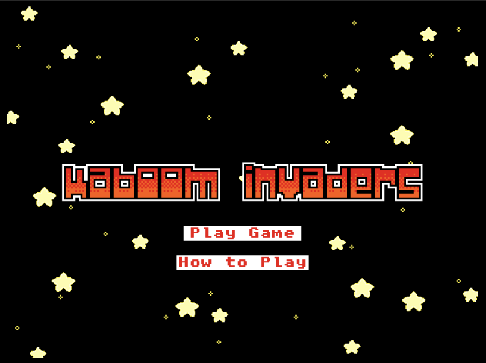
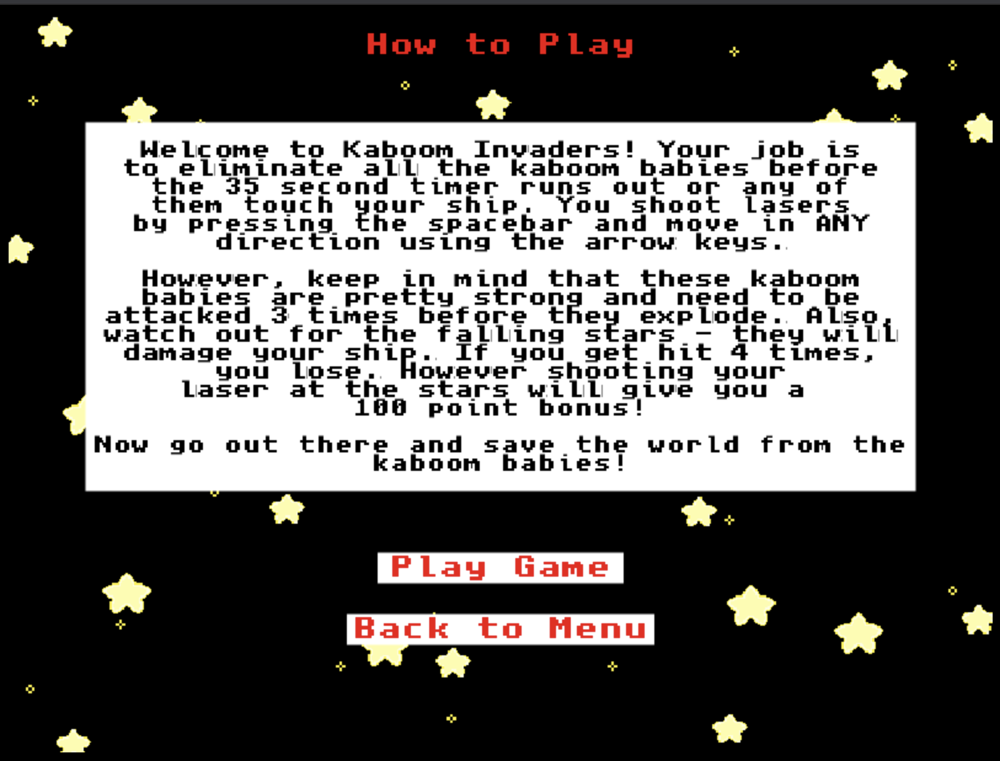
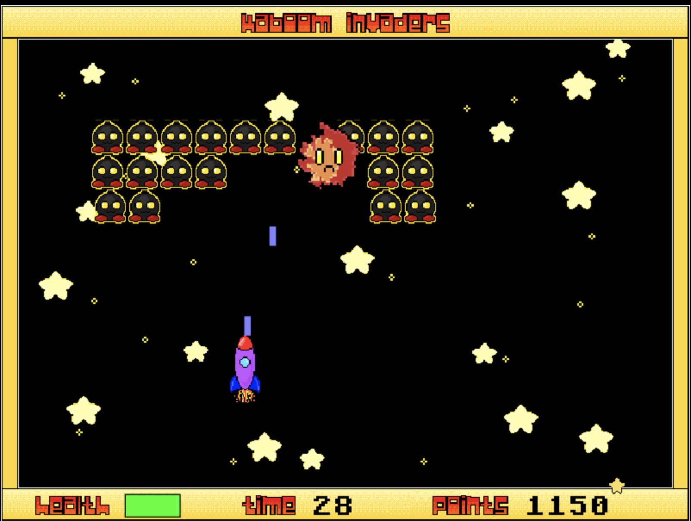

# Kaboom Invaders (Website Repo)

A live version of this project can be found here: [Kaboom Invaders](https://kaboom-invaders.netlify.app/). All the information about the game, including a demo video, can be found there.

The game repo is located [here](https://github.com/amad3usz/kaboom-invaders), while direct access to the game can be found [here](https://kaboom-invaders-game.netlify.app/)

## **About the Site and Game**

The website was built with the ReactJS and Reactstrap libraries.

This is a game I built for a Mintbean hackathon. I primarily used JavaScript and the KaboomJS library to create it. This game is essentially a Space Invaders remake with a few little extras. The graphics were created by myself, but heavily inspired by others' work (I'm not that creative). The sound effects and music were found on freesound.org, with the exception of the explosion sound effect, which was borrowed from a KaboomJS example. A more detailed explanation, including instructions and a demo video, can be found at the Kaboom Invaders website.

## **Screenshots of the Game**

Main Menu

Instructions

Gameplay

## **How to Play**

If you've ever played a shoot 'em up arcade game, you'll find the mechanics of Kaboom Invaders to be very similar (think Space Invaders). To move your rocket around the screen, use the arrow keys. Not only can you move left and right, you can also move up and down, which might prove to be helpful, especially if you want to beat your previous high score. To shoot your laser, you just tap the spacebar. That's basically it for controls.

In order to win the game, you must shoot down all the Kaboom Babies before the timer runs out or before one collides with your rocket. These Kaboom Babies are particularly strong and your laser won't get them in one hit. You must hit a Kaboom Baby 3 times before it finally explodes. Another thing to watch out for are falling stars. They will damage your rocket if you get hit, and once they hit 4 times, your ship is gone! Pay attention to the health bar in the bottom left to see how you're holding up. However, shooting a falling star with your laser beam will give you an extra 100 points, so don't completely avoid them!

## **Deploying the Site**

1. Clone the repo and install dependencies:

`yarn install`

2. Run the app in development mode:

`yarn start`

## **Deploying the Game**

Go to the game repo ([here](https://github.com/amad3usz/kaboom-invaders)) and follow the instructions there.

## **Developed by Amadeusz Sepko**

[GitHub](https://github.com/amad3usz)

[LinkedIn](https://www.linkedin.com/in/amad3usz/)

## **Hope You Enjoy!**
